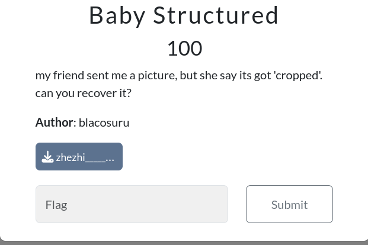
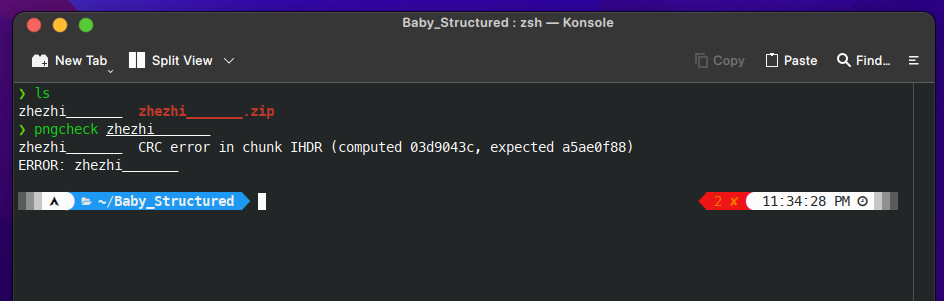
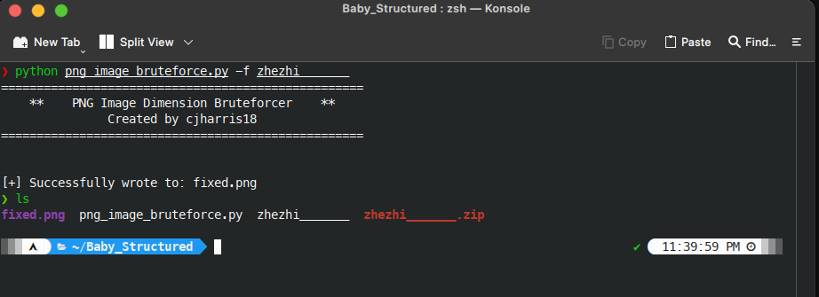

# Baby Structured

>my friend sent me a picture, but she say its got 'cropped'. can you recover it?

*Category: Forensics* 

## Approach



Dari challenge ini kami diberikan sebuah file zip dan ketika di ekstrak terdapat sebuah gambar berformat PNG yang tidak dapat dibuka dikarenakan terdapat image size yang tidak cocok dengan crc checksum pada png. 



Untuk mengubah ukuran gambar, kita perlu mengetahui letak width dan height pada PNG. Informasi ini terdapat pada header IHDR. Dalam IHDR, terdapat 13 byte: 4 byte pertama untuk width, 4 byte berikutnya untuk height, dan sisa 5 byte untuk informasi lainnya.


Checksum untuk setiap chunk, termasuk IHDR, terdapat pada bagian akhir chunk tersebut, yaitu dalam 4 byte CRC (Cyclic Redundancy Check). Untuk memperbaiki nilai height/width yang salah pada header IHDR, kami menggunakan metode brute force dengan mencocokkannya dengan checksum file yang benar. untuk toolsnya sendiri kami mendapatkannya dari link github https://github.com/cjharris18/png-dimensions-bruteforcer dan ketika tools brute force dijalankan dan menemukan image size yang cocok dengan checksum maka tools akan berhenti dan ini hasilnya 

```bash
./png_image_bruteforce.py -f <file> 
```



Berikut adalah gambar yang dihasilkan


*Flag*: gemastik{g0t_cr0pped_by_structur3}