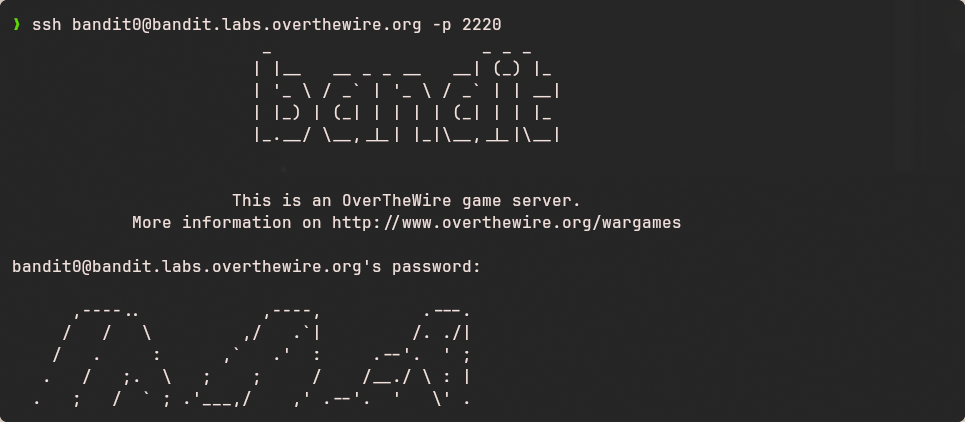
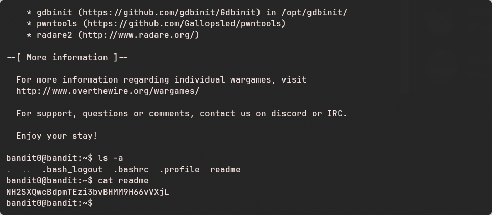

# Bandit - Level 0-1

## Approach

>The password for the next level is stored in a file called **readme** located in the home directory. Use this password to log into bandit1 using SSH. Whenever you find a password for a level, use SSH (on port 2220) to log into that level and continue the game.

## Explanation

Dari soal diatas, untuk mendapatkan password dari level berikutnya, terdapat sebuah file bernama **readme** di dalam home directory. 

Pertama, login menggukanan SSH seperti pada Level sebelumnya, menggunakan perintah berikut dan masukkan **bandit0** ketika diminta password.

``` bash
ssh bandit0@bandit.labs.overthewire.org
```



Selanjutnya gunakan command **cat** untuk membuka file **readme**

```bash
cat readme
```


Sehingga didapatkan password seperti berikut :

Result: `NH2SXQwcBdpmTEzi3bvBHMM9H66vVXjL`

Password inilah yang akan digunakan untuk masuk ke room pada level berikutnya.

