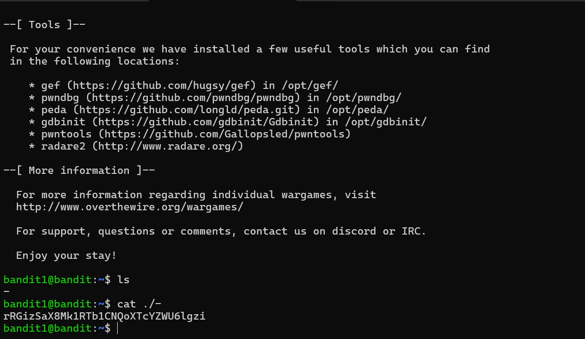

# Bandit - Level 1-2

## Approach

> The password for the next level is stored in a file called **-** located in the home directory

## Explanation

Dari soal diatas terdapat sebuah file bernama `-` terbukti ketika dimasukan command ls, untuk menampilkan isi file dari - dapat diketikan dengan perintah berikut
```
cat ./-
```



Result: `rRGizSaX8Mk1RTb1CNQoXTcYZWU6lgzi`

