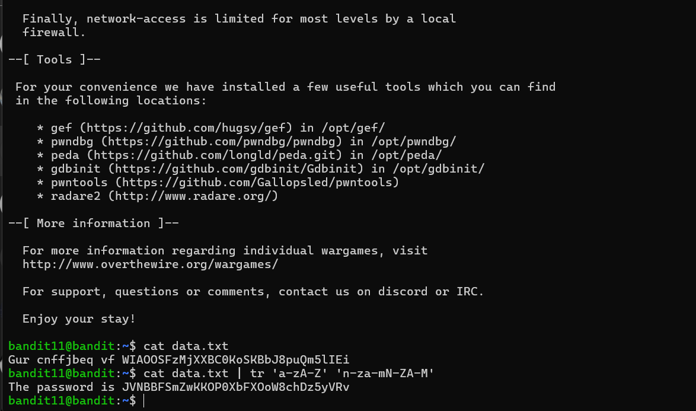

# Bandit - Level 10-11

## Approach

> The password for the next level is stored in the file **data.txt**, where all lowercase (a-z) and uppercase (A-Z) letters have been rotated by 13 positions

## Explanation

Dari soal diatas dijelaskan bahwa terdapat password yang nantinya digunakan untuk login ke next level berikutnya, dijelaskan huruf dirotasikan 13 kali hal ini sering disebut dengan ROT13 untuk perintahnya dapat menggunakan dibawah ini

```
bandit11@bandit:~$ cat data.txt | tr 'a-zA-Z' 'n-za-mN-ZA-M'
```



Result: `JVNBBFSmZwKKOP0XbFXOoW8chDz5yVRv`
