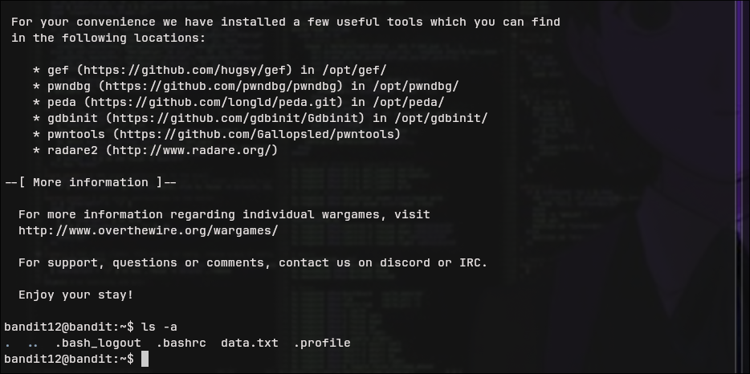
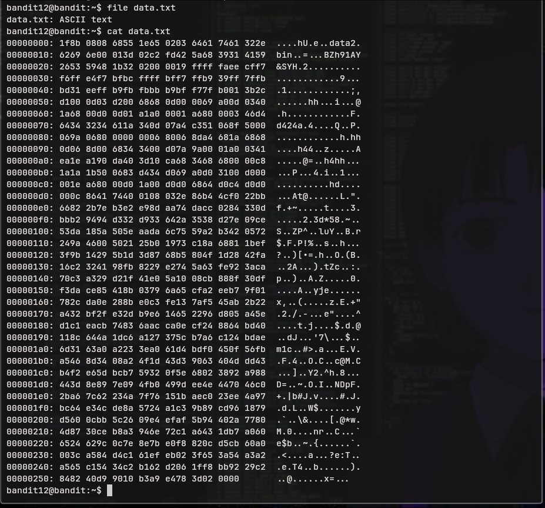
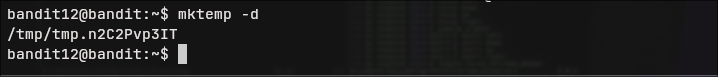
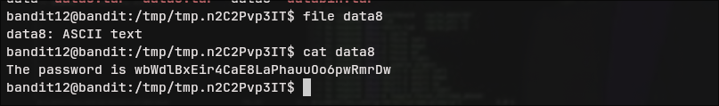

  
# Bandit - Level 12-13

## Approach

>The password for the next level is stored in the file **data.txt**, which is a hexdump of a file that has been repeatedly compressed. For this level it may be useful to create a directory under /tmp in which you can work. Use mkdir with a hard to guess directory name. Or better, use the command “mktemp -d”. Then copy the datafile using cp, and rename it using mv (read the manpages!)
## Explanation

Terdapat sebuah file **data.txt** dengan tipe ASCII, kita coba lihat isi filenya





Dari file tersebut terlihat bahwa ini merupakan data hexadecimal, kita akan melakukan konversi dari hexadecimal ke binary untuk mendapatkan file yang sebenarnya. Sebelum itu, buat folder terlebih dahulu di dalam **/tmp** dengan menggunakan perintah berikut.

```bash
bandit12@bandit:~$ mktemp -d
/tmp/tmp.n2C2Pvp3IT
```



Pindahkan file **data.txt** ke folder tersebut

```bash
bandit12@bandit:~$ cp data.txt /tmp/tmp.n2C2Pvp3IT
bandit12@bandit:~$ cd /tmp/tmp.n2C2Pvp3IT
bandit12@bandit:/tmp/tmp.n2C2Pvp3IT$ ls          
data.txt 
```

Rubah nama file **data.txt** ke **data**

``` bash
bandit12@bandit:/tmp/tmp.n2C2Pvp3IT$ mv data.txt data
```

Gunakan **xxd** untuk melakukan konversi, flag **-r** digunakan untuk melakukan reverse, yakni dari hexadecimal ke binary

```bash
bandit12@bandit:/tmp/tmp.n2C2Pvp3IT$ xxd -r data > databin
bandit12@bandit:/tmp/tmp.n2C2Pvp3IT$ ls
data  databin
bandit12@bandit:/tmp/tmp.n2C2Pvp3IT$ 
```

Kita dapat menggunakan perintah **file** untuk melihat jenis file 

```bash
bandit12@bandit:/tmp/tmp.n2C2Pvp3IT$ file databin
databin: gzip compressed data, was "data2.bin", last modified: Thu Oct  5 06:19:20 2023, max compression, from Unix, original size modulo 2^32 573
```

### Ekstraksi Pertama - Gzip

Terlihat bahwa file tersebut merupakan file gzip, seperti pada petunjuk yang diberikan pada soal, file ini merupakan file yang dikompres berkali kali. Selanjutnya kita akan mengekstrak file tersebut.
Sebelum itu rubah nama file terlebih dahulu lalu lakukan decompress/ekstrak

```bash
bandit12@bandit:/tmp/tmp.n2C2Pvp3IT$ mv data.gz databin.gz
bandit12@bandit:/tmp/tmp.n2C2Pvp3IT$ gzip -d databin.gz
bandit12@bandit:/tmp/tmp.n2C2Pvp3IT$ ls
data  databin
```

Seperti langkah sebelumnya, gunakan command **file** untuk melihat jenis file 

```bash
bandit12@bandit:/tmp/tmp.n2C2Pvp3IT$ file databin
databin: bzip2 compressed data, block size = 900k
```

### Ekstraksi Kedua - Bzip2

Nampak kali ini merupakan file dengan kompresi bzip2, masih sama seperti sebelumnya, rubah dahulu nama file lalu lakukan ekstraksi

```bash
bandit12@bandit:/tmp/tmp.n2C2Pvp3IT$ mv databin databin.bz2
bandit12@bandit:/tmp/tmp.n2C2Pvp3IT$ bzip2 -d databin.bz2 
bandit12@bandit:/tmp/tmp.n2C2Pvp3IT$ ls
data  databin
```

```bash
bandit12@bandit:/tmp/tmp.n2C2Pvp3IT$ ls
data  databin
bandit12@bandit:/tmp/tmp.n2C2Pvp3IT$ file databin
databin: gzip compressed data, was "data4.bin", last modified: Thu Oct  5 06:19:20 2023, max compression, from Unix, original size modulo 2^32 20480
```

### Ekstraksi Ketiga - Gzip

Sepertinya kali ini kembali menggunakan jenis gzip sebagai kompresi, kembali lakukan seperti sebelumnya.

```bash
bandit12@bandit:/tmp/tmp.n2C2Pvp3IT$ mv databin databin.gz
bandit12@bandit:/tmp/tmp.n2C2Pvp3IT$ gzip -d databin.gz 
bandit12@bandit:/tmp/tmp.n2C2Pvp3IT$ ls
data  databin
```

Lakukan perintah **file** lagi untuk mengetahui jenis file

```bash
bandit12@bandit:/tmp/tmp.n2C2Pvp3IT$ file databin
databin: POSIX tar archive (GNU)
```
### Ekstraksi Keempat - Tar

Untuk melakukan dekompresi, rubah nama file menjadi **.tar** dan gunakan perintah **tar -xf**

```bash
bandit12@bandit:/tmp/tmp.n2C2Pvp3IT$ mv databin databin.tar
bandit12@bandit:/tmp/tmp.n2C2Pvp3IT$ tar -xf databin.tar 
bandit12@bandit:/tmp/tmp.n2C2Pvp3IT$ ls
data  data5.bin  databin.tar
bandit12@bandit:/tmp/tmp.n2C2Pvp3IT$ file data5.bin 
data5.bin: POSIX tar archive (GNU)
```

Nampak bahwa file kompresi berikutnya masih bertipe **tar**, lakukan lagi seperti pada langkah keempat

### Ekstraksi Kelima - Tar

```bash
bandit12@bandit:/tmp/tmp.n2C2Pvp3IT$ mv data5.bin data5.tar
bandit12@bandit:/tmp/tmp.n2C2Pvp3IT$ tar -xf data5.tar
bandit12@bandit:/tmp/tmp.n2C2Pvp3IT$ ls
data  data5.tar  data6.bin  databin.tar
bandit12@bandit:/tmp/tmp.n2C2Pvp3IT$ file data6.bin
data6.bin: bzip2 compressed data, block size = 900k
```

### Ekstraksi Keenam - Bzip2

```bash
bandit12@bandit:/tmp/tmp.n2C2Pvp3IT$ mv data6.bin data6.bz2
bandit12@bandit:/tmp/tmp.n2C2Pvp3IT$ bzip2 -d data6.bz2 
bandit12@bandit:/tmp/tmp.n2C2Pvp3IT$ ls
data  data5.tar  data6  databin.tar
bandit12@bandit:/tmp/tmp.n2C2Pvp3IT$ file data6
data6: POSIX tar archive (GNU)
```

### Ekstraksi Ketujuh - Tar

```bash
bandit12@bandit:/tmp/tmp.n2C2Pvp3IT$ mv data6 data6.tar
bandit12@bandit:/tmp/tmp.n2C2Pvp3IT$ tar -xf data6.tar
bandit12@bandit:/tmp/tmp.n2C2Pvp3IT$ ls
data  data5.tar  data6.tar  data8.bin  databin.tar
```

```bash
bandit12@bandit:/tmp/tmp.n2C2Pvp3IT$ file data8.bin 
data8.bin: gzip compressed data, was "data9.bin", last modified: Thu Oct  5 06:19:20 2023, max compression, from Unix, original size modulo 2^32 49
```
### Ekstraksi Kedelapan - Gzip

```bash
bandit12@bandit:/tmp/tmp.n2C2Pvp3IT$ mv data.gz data8.gz
bandit12@bandit:/tmp/tmp.n2C2Pvp3IT$ gzip -d data8.gz 
bandit12@bandit:/tmp/tmp.n2C2Pvp3IT$ ls
data  data5.tar  data6.tar  data8  databin.tar
bandit12@bandit:/tmp/tmp.n2C2Pvp3IT$ file data8
data8: ASCII text
```

Langkah terakhir buka file **data8**, inimerupakan file asli yang berisi password

```bash
bandit12@bandit:/tmp/tmp.n2C2Pvp3IT$ cat data8
The password is wbWdlBxEir4CaE8LaPhauuOo6pwRmrDw
```


Result: `wbWdlBxEir4CaE8LaPhauuOo6pwRmrDw`

