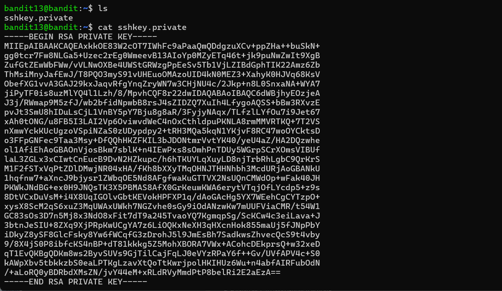
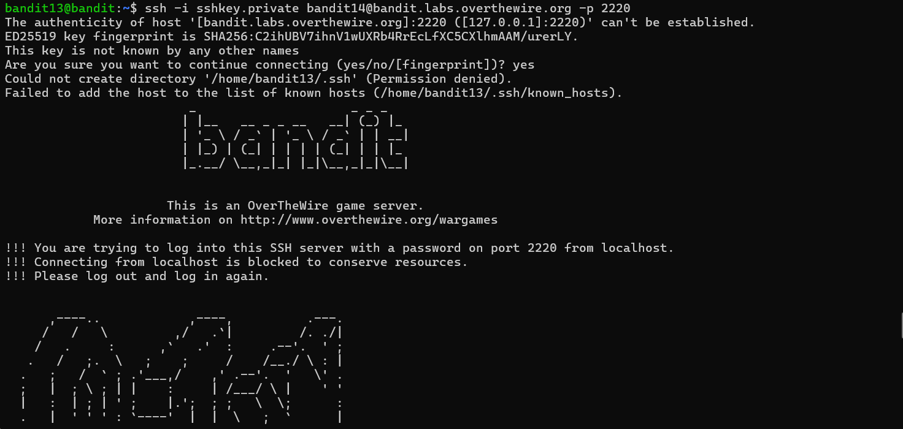
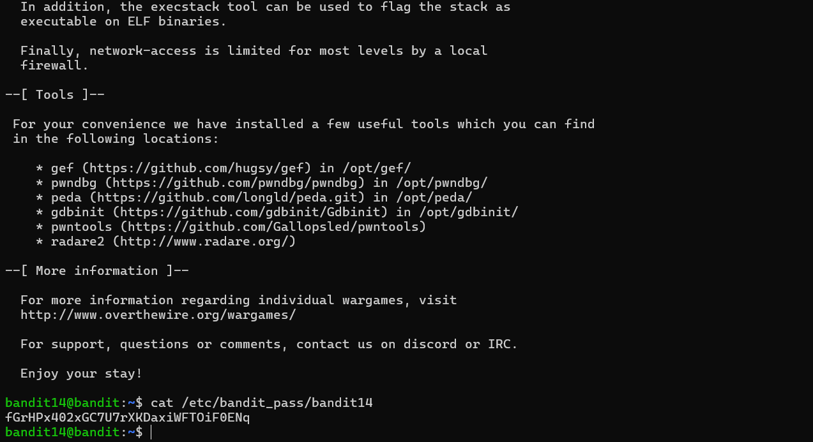

# Bandit - Level 13-14
## Approach

> The password for the next level is stored in **/etc/bandit_pass/bandit14 and can only be read by user bandit14**. For this level, you don’t get the next password, but you get a private SSH key that can be used to log into the next level. **Note:** **localhost** is a hostname that refers to the machine you are working on

## Explanation

Dari soal yang diberikan, diberikan sebuah privat key untuk mengakses next level berikutnya tanpa menggunakan password dan password dari ssh brikutnya disimpan pada  **/etc/bandit_pass/bandit14**  .ketika dicoba perintah ls terdapat sebuah file bernama **sshkey.privat** dan ketika dicat akan terlihat sebuah privat key ssh untuk bandit14

```
ls
```

```
cat sshkey.private
```



 untuk mengakses ssh tanpa password dapat dengan komen berikut.

```
ssh -i sshkey.private bandit14@bandit.labs.overthewire.org -p 2220
```


Untuk langkah berikutnya kita mencari password untuk ssh bandit14 dengan menampilkan file dari directory  **/etc/bandit_pass/bandit14** dengan menggunakan perintah 
```
cat /etc/bandit_pass/bandit14
```


Result: `fGrHPx402xGC7U7rXKDaxiWFTOiF0ENq`
