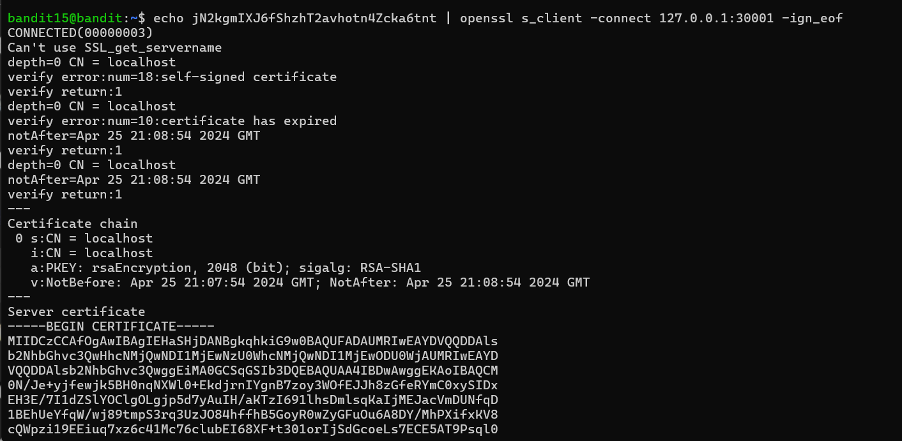
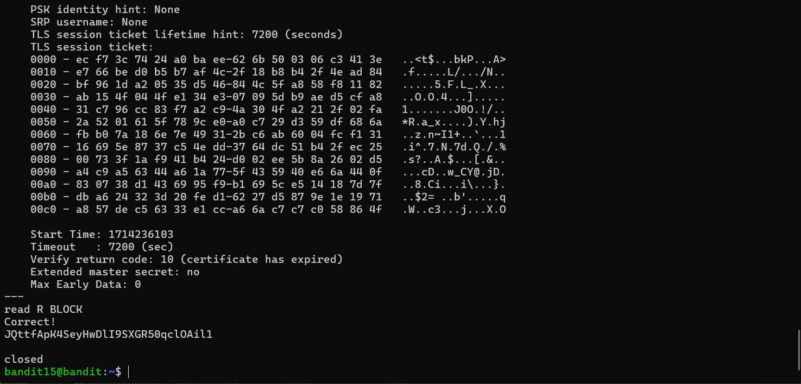

# Bandit - Level 15-16
## Approach

> The password for the next level can be retrieved by submitting the password of the current level to **port 30001 on localhost** using SSL encryption.

**Helpful note: Getting “HEARTBEATING” and “Read R BLOCK”? Use -ign_eof and read the “CONNECTED COMMANDS” section in the manpage. Next to ‘R’ and ‘Q’, the ‘B’ command also works in this version of that command…**

## Explanation

Dari soal yang diberikan untuk mendapatkan password next level perlu mengirimkan password level ini localhost dengan port 30001 dengan mengunakan ssl, dengan soal yang diberikan dapat digunakan perintah openssl dengan s_client agar terhubung secara ssl dan tambahan option -ign_eof agar menjaga koneksi tetap terbuka ketika data telah di berikan. untuk perintahnya seperti berikut

```
echo jN2kgmIXJ6fShzhT2avhotn4Zcka6tnt | openssl s_client -connect 127.0.0.1:30001 -ign_eof
```



Setelah mengirimkan password ke localhot maka passsword next level akan diberikan di bagian bawah



Result: `JQttfApK4SeyHwDlI9SXGR50qclOAil1`
