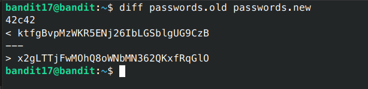

# Bandit - Level 19-20

## Approach

> There are 2 files in the homedirectory: passwords.old and passwords.new. The password for the next level is in passwords.new and is the only line that has been changed between passwords.old and passwords.new

__NOTE: if you have solved this level and see ‘Byebye!’ when trying to log into bandit18, this is related to the next level, bandit19__

## Explanation

ketika kita sudah masuk melalui private key, kita akan diberikan 2 buah file yaitu `passwords.old` dan `passwords.new` dari kedua file tersebut kita disuruh membandingkan perbedaan isi dari file tersebut, pada linux untuk membandingkan dua buah file kita dapat menggunakan perintah `diff`, untuk lebih lanjutnya bisa dilihat dibawah ini.

```sh
bandit17@bandit:~$ diff passwords.old passwords.new
```



Result: `0qXahG8ZjOVMN9Ghs7iOWsCfZyXOUbYO`
