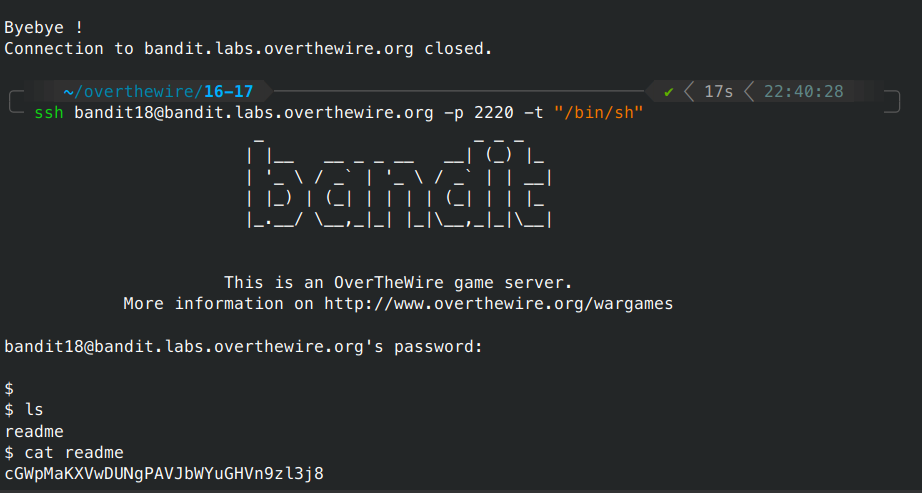

# Bandit - Level 18-19

## Approach

> The password for the next level is stored in a file readme in the homedirectory. Unfortunately, someone has modified .bashrc to log you out when you log in with SSH.

## Explanation

Ketika kita masuk menggunakan ssh seperti level level sebelumnya otomatis kita akan logout karena file .bashrc sudah dimodifikasi, tetapi kita dapat masuk menggunakan tambahan `-t "/bin/sh"` yang artinya kita dapat menampilkan terminal shell Bourne tanpa keluar dari sesi.

```sh
ssh bandit18@bandit.labs.overthewire.org -p 2220 -t "/bin/sh"
```



Result: `cGWpMaKXVwDUNgPAVJbWYuGHVn9zl3j8`
