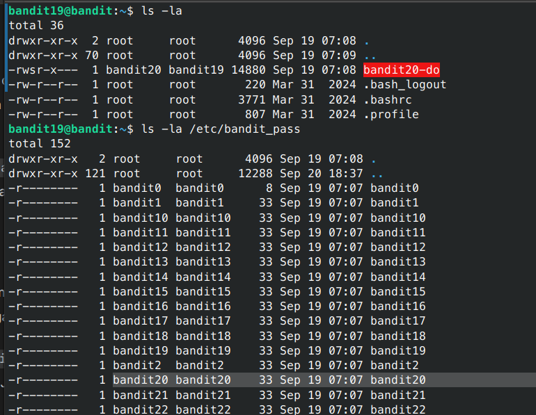
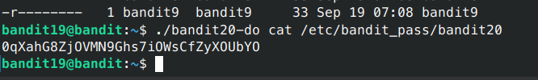

# Bandit - Level 19-20

## Approach

> To gain access to the next level, you should use the setuid binary in the homedirectory. Execute it without arguments to find out how to use it. The password for this level can be found in the usual place (/etc/bandit_pass), after you have used the setuid binary.

## Explanation

Dari soal diatas password untuk level selanjutnya dapat diakses pada /etc/bandit_pass tetapi waktu masuk terdapat file bandit20-do yang memiliki permission seperti berikut ini

Terlihat disitu bahwa file `bandit20-do` mempunyai permission -rwsr-x--- yang artinya ketika file itu dijalankan makan akan dijalakan sebagai user dan user pada file tersbut adalah user bandit20, kemudian ketika melihat list directory /etc/bandit_pass terlihat untuk file bandit20 memiliki user dan group bandit20 sehingga file bandit20 yang terletak pada /etc/bandit_pass dapat dieksekusi oleh bandit20-do.

Result: `0qXahG8ZjOVMN9Ghs7iOWsCfZyXOUbYO`
