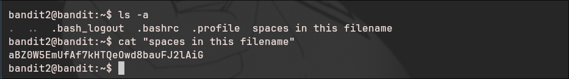

# Bandit - Level 2-3

## Approach

> The password for the next level is stored in a file called **spaces in this filename** located in the home directory

## Explanation

Dari soal diatas terdapat sebuah file yang bernama **spaces in this filename** coba lihat dulu file yang berada dalam directory ini, terlihat disitu ada sebuah file dengan nama  **spaces in this filename** untuk membaca file yang teradapat spasi pada linux dapat dilakukan dengan menambahkan `" "` tanda kutip, untuk itu perintah yang digunakan seperti dibawah ini 
```
bandit2@bandit:cat "spaces in this filename"
```



Result: `aBZ0W5EmUfAf7kHTQeOwd8bauFJ2lAiG`

