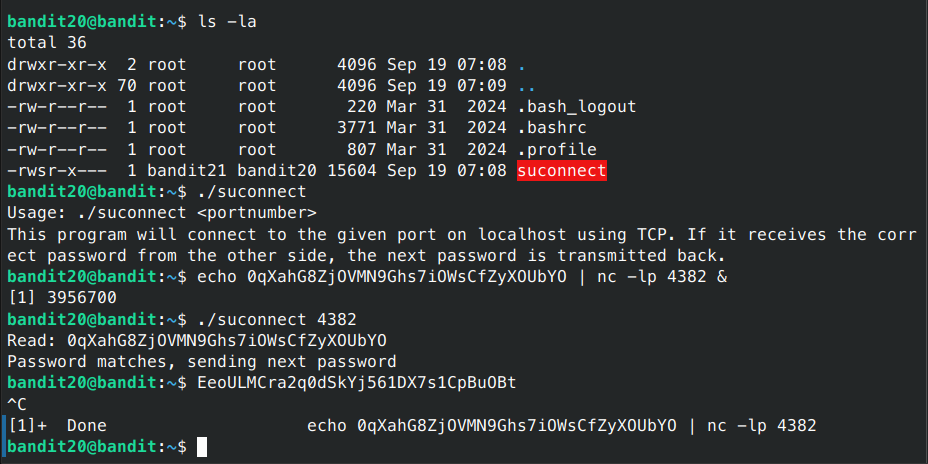

# Bandit - Level 20-21

## Approach

> There is a setuid binary in the homedirectory that does the following: it makes a connection to localhost on the port you specify as a commandline argument. It then reads a line of text from the connection and compares it to the password in the previous level (bandit20). If the password is correct, it will transmit the password for the next level (bandit21).

## Explanation

Dari soal diatas diberikan lagi sebuah file dengan permission -rwsr-x--- (bit setuid), yang berarti ketika file tersebut akan dijalankan sebagai user bandit21,  



Dari keterangan tersebut berarti kita harus menjalankan sebuah port dengan password yang benar, dan port tersebut tidak boleh tertutup. Untuk menjalankan nc dilatar belakang kita bisa menggunakan sebuah tambahan parameter `&`, parameter ini dapat membuat nc bekerja dilatar belakang. Untuk perintahnya bisa dilihat dibawah ini

```sh
bandit20@bandit:~$ echo 0qXahG8ZjOVMN9Ghs7iOWsCfZyXOUbYO | nc -lp 4382 &
```

Result: `EeoULMCra2q0dSkYj561DX7s1CpBuOBt`
