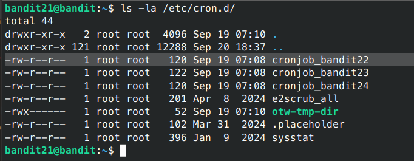
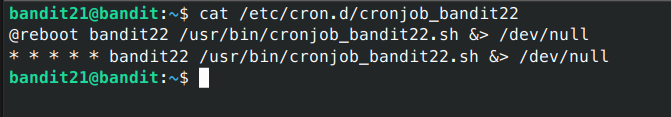
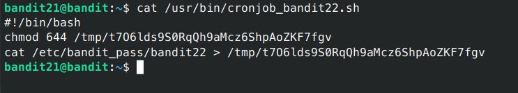
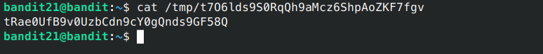

# Bandit - Level 21-22

## Approach

> A program is running automatically at regular intervals from cron, the time-based job scheduler. Look in /etc/cron.d/ for the configuration and see what command is being executed.

## Explanation

Dari soal diatas terdapat sebuah file cronjobs yaitu file yang dieksekusi secara terjadwal dengan waktu yang telah ditetapkan, kita coba lihat isi dari folder `/etc/cron.d/`

```sh
bandit21@bandit:~$ ls -la /etc/cron.d/
```



Terlihat disitu terdapat sebuah file cronjobs untuk level selanjutnya, langsung saja kita buka isinya.

```sh
bandit21@bandit:~$ cat /etc/cron.d/cronjob_bandit22
```



Terlihat disitu bahwa file /usr/bin/cronjob_bandit22.sh yang dimiliki oleh bandit22 akan dijalankan otomatis ketika sistem rebooot, dan baik outputnya (stdout/stderr) akan dibuang ke /dev/null. Mari kita coba lihat perintah apa yang dijalankan.

```sh
bandit21@bandit:~$ cat /usr/bin/cronjob_bandit22.sh
```



Setelah dilihat ternyata didalam file `cronjob_bandit22.sh` melakukan cat password kemudian disimpan kedalam file tmp.

```sh
bandit21@bandit:~$ cat /tmp/t7O6lds9S0RqQh9aMcz6ShpAoZKF7fgv
```



Result: `tRae0UfB9v0UzbCdn9cY0gQnds9GF58Q`
