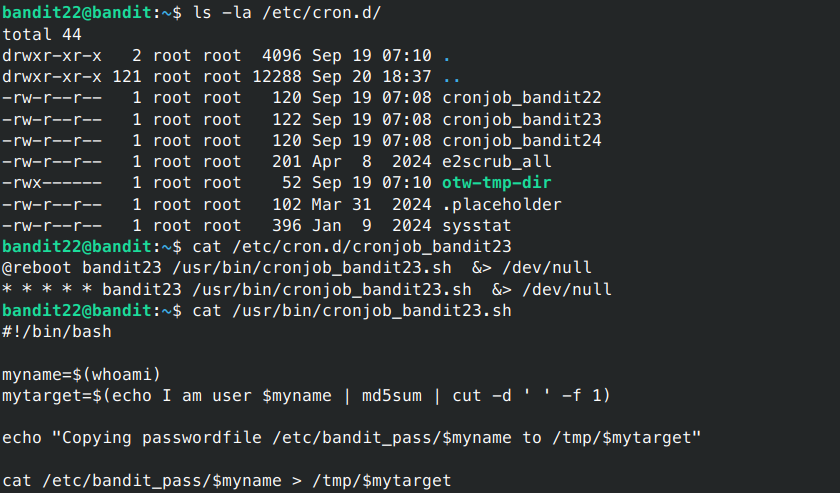

# Bandit - Level 22-23

## Approach

> A program is running automatically at regular intervals from cron, the time-based job scheduler. Look in /etc/cron.d/ for the configuration and see what command is being executed.

__NOTE: Looking at shell scripts written by other people is a very useful skill. The script for this level is intentionally made easy to read. If you are having problems understanding what it does, try executing it to see the debug information it prints.__

## Explanation

Dari soal diatas ini mirip dengan soal yang berikan sebelumnya langsung saja kita lihat isi yang ada pada file cronjob tersebut



Dapat dilihat bahwa isi dari file tersebut adalah mengcopy pasword ke file tmp, tetapi nama dari file tmp tersebut tersusun dari nama user bandit23 kemudian file tersebut di hash kedalam md5 dan di potong dan dijadikan nama untuk file tmp. untuk lebih mudahnya sebenarnya kita bisa melihat nama secara langsung dengan menjalankan perintah tersebut

```sh
bandit22@bandit:~$ echo I am user bandit23 | md5sum | cut -d ' ' -f 1
bandit22@bandit:~$ cat /tmp/8ca319486bfbbc3663ea0fbe81326349

```

Result: `0Zf11ioIjMVN551jX3CmStKLYqjk54Ga`
