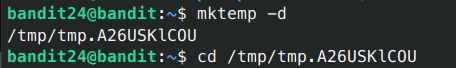
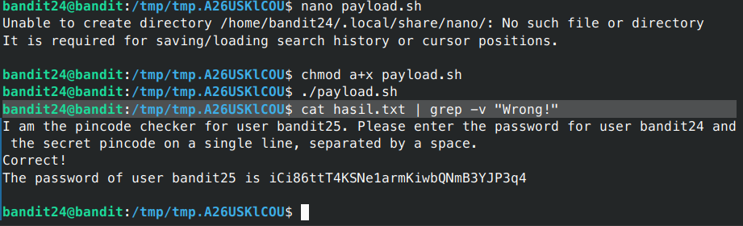

# Bandit - Level 24-25

## Approach

> A daemon is listening on port 30002 and will give you the password for bandit25 if given the password for bandit24 and a secret numeric 4-digit pincode. There is no way to retrieve the pincode except by going through all of the 10000 combinations, called brute-forcing.You do not need to create new connections each time

## Explanation

Dari soal diatas untuk mendapatkan password untuk level berikutnya kita diperlukan untuk memberikan password saat ini + 4 digin dari 0000-9999 yang nantinya akan dikirikan melalui nc localhost 30002, untuk itu kita perlu membuat sebuah script untuk melakukan brute force tersebut, sebelum membuaty script kita buat dulu folder tmpnya.



Setelah membuat folder tmp selanjutnya kita buat payload untuk membrute forcenya.

```sh
#!/bin/bash 

for i in {0000..9999}
do
        echo gb8KRRCsshuZXI0tUuR6ypOFjiZbf3G8 $i >> cobapass.txt
done

cat cobapass.txt | nc localhost 30002 > hasil.txt
```

Setelah menunggu beberapa saat kita cari password untuk level berikutnya pada hasil.txt dengan menggunakan `grep`

```sh
bandit24@bandit:/tmp/tmp.A26USKlCOU$ cat hasil.txt | grep -v "Wrong!"
```



Result: `iCi86ttT4KSNe1armKiwbQNmB3YJP3q4`
