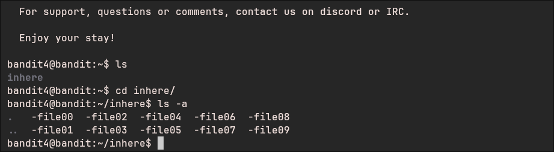
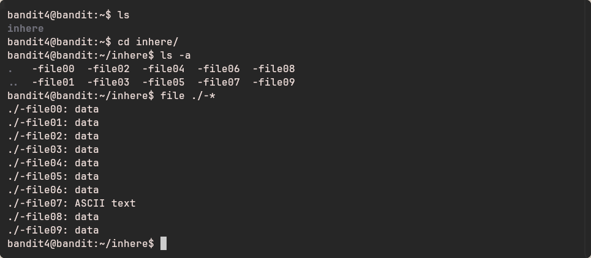
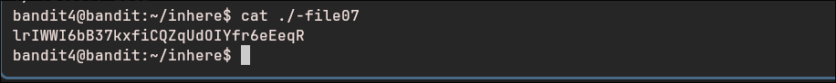

  
# Bandit - Level 4-5

## Approach

>The password for the next level is stored in the only human-readable file in the **inhere** directory. Tip: if your terminal is messed up, try the “reset” command.
## Explanation

Terdapat sebuah folder bernama **inhere**, di dalamnya berisi file dengan nama **-file00** sampai **-file09**



Kita berasumsi password berada pada salah satu dari file tersebut, gunakan perintah berikut untuk mengecek file satu per satu secara bersamaan

``` bash
file ./-*
```



Hanya satu file yang memiliki tipe **ASCII text** yaitu **-file07**



Result: `lrIWWI6bB37kxfiCQZqUdOIYfr6eEeqR`
