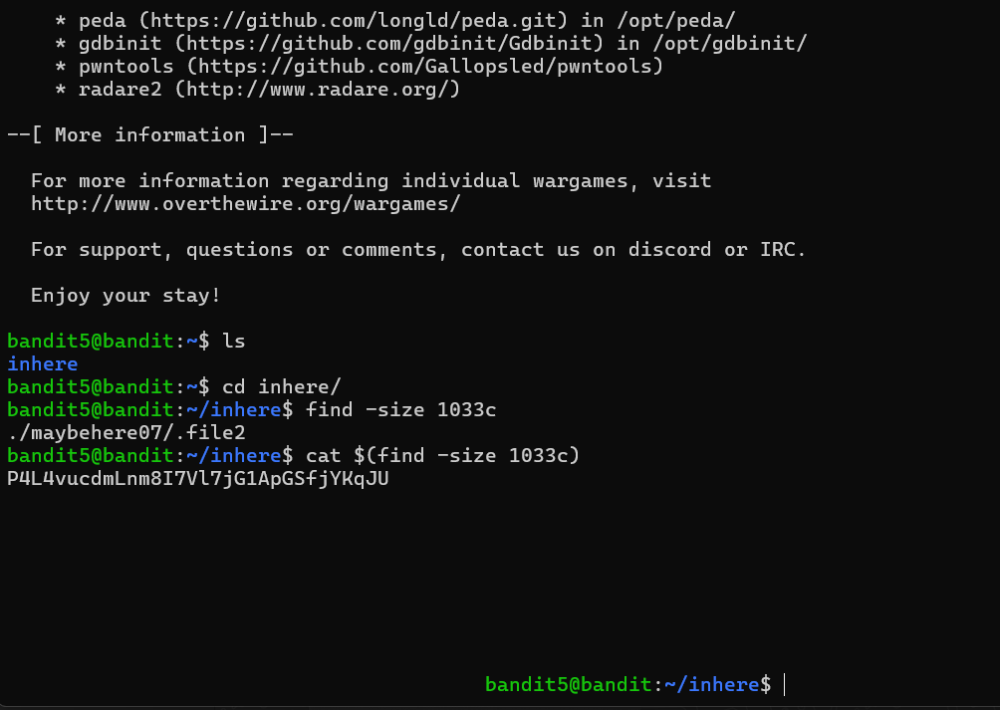

# Bandit - Level 5-6

## Approach

> The password for the next level is stored in a file somewhere under the **inhere** directory and has all of the following properties:

- human-readable
- 1033 bytes in size
- not executable

## Explanation

Dari soal diatas terdapat sebuah file di folder inhere dengan kentuan seperti yang ada di atas. coba cari dari size file tersebut dengan menggunakan options -size , setelah dilakukan terdapat 1 folder yang berisi file dengan size 1033 byte, kemdian coba kita tampilkan isi dari file tersebut. Untuk perintah yang digunakan bisa menggunakan dibawah ini 
```
bandit5@bandit:~/inhere$ cat $(find -size 1033c)
```



Result: `P4L4vucdmLnm8I7Vl7jG1ApGSfjYKqJU`

