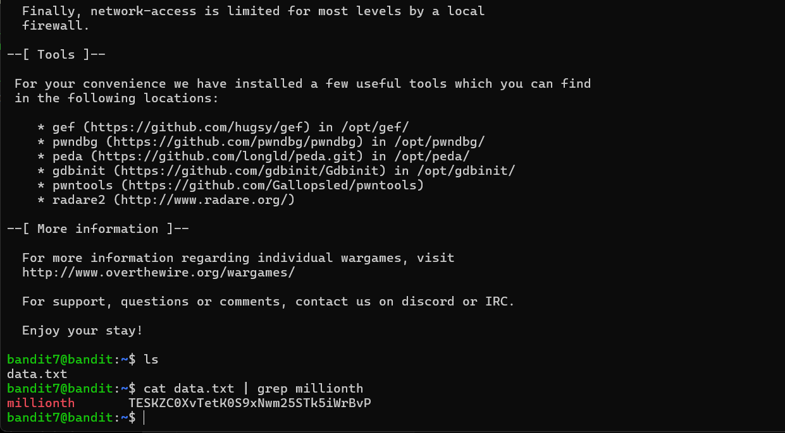

# Bandit - Level 7-8

## Approach

> The password for the next level is stored in the file **data.txt** next to the word **millionth**

## Explanation

Dari soal diatas dijelaskan bahwa terdapat password yang nantinya digunakan untuk login ke next level berikutnya, letak dari password ada didalam file data.txt disamping kata **millionth** langsung saja kita buka dan cari password di samping kata **millionth** dengan perintah dibawah ini
```
bandit7@bandit:~$ cat data.txt | grep millionth
```



Result: `TESKZC0XvTetK0S9xNwm25STk5iWrBvP`
