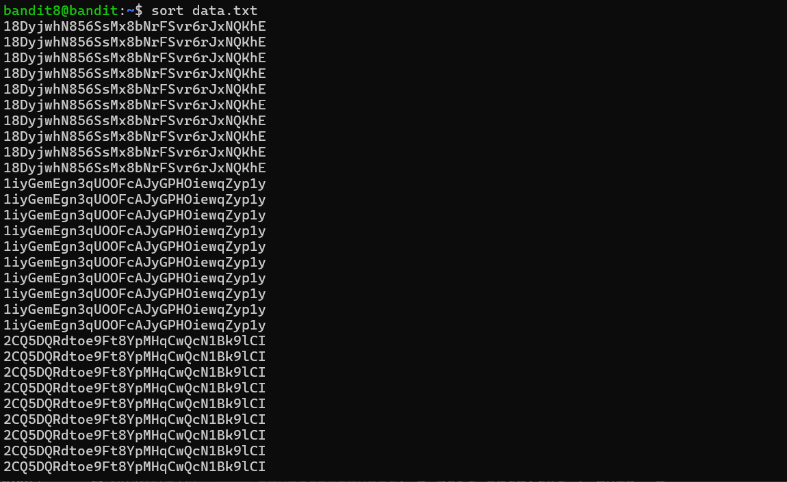
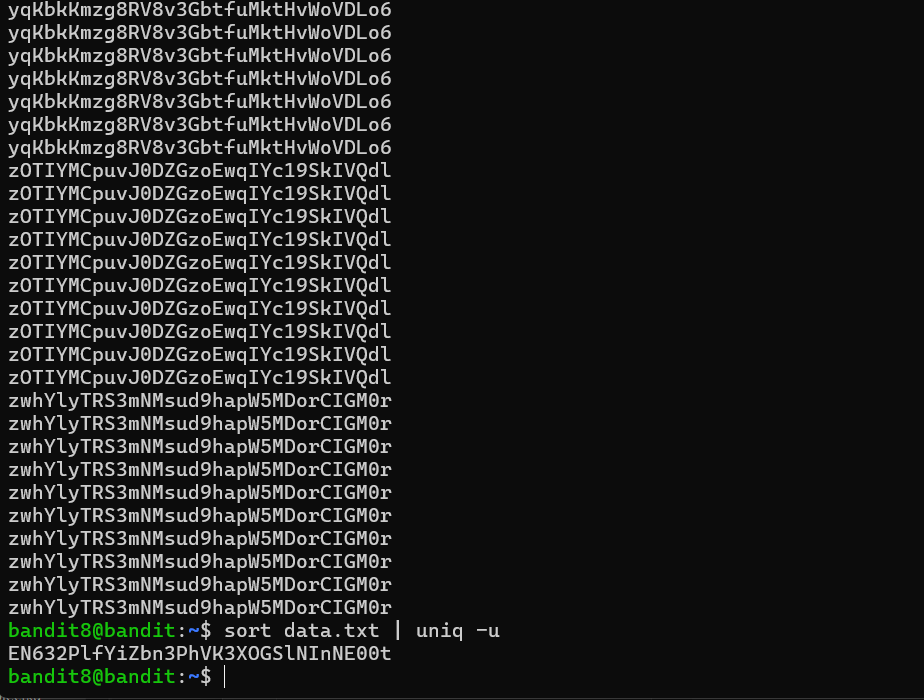

# Bandit - Level 8-9

## Approach

> The password for the next level is stored in the file **data.txt** and is the only line of text that occurs only once

## Explanation

Dari soal diatas dijelaskan bahwa terdapat password yang nantinya digunakan untuk login ke next level berikutnya, ketika di coba di urutkan datanya terlihat seperti ini
```
bandit8@bandit:~$ sort data.txt
```



Terlihat bahwa terdapat text yang berulang ulang, kemudian coba kita cari apakah ada yang uniq/berbeda dari isi **data.txt** dengan menggunakan perintah berikut 

```
bandit8@bandit:~$ sort data.txt | uniq -u
```

Result: `EN632PlfYiZbn3PhVK3XOGSlNInNE00t`
