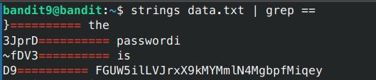

# Bandit - Level 5-6

## Approach

> The password for the next level is stored **somewhere on the server** and has all of the following properties:

- owned by user bandit7
- owned by group bandit6
- 33 bytes in size

## Explanation

Dari soal diatas setelah dipahami terdapat sebuah file

```sh
bandit9@bandit:~$ strings data.txt | grep ==
```



Dari soal diatas kita mencari string dengan menggunakan perintah `strings` kemudian kit ambil yang mengandung == pada sebuah baris

Result: `morbNTDkSW6jIlUc0ymOdMaLnOlFVAaj`

