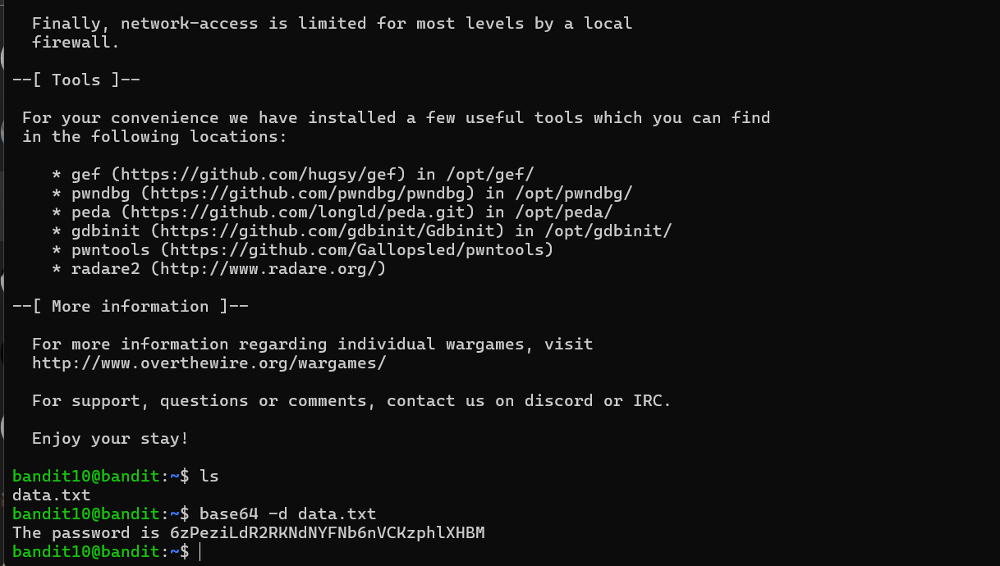

# Bandit - Level 10-11

## Approach

> The password for the next level is stored in the file **data.txt**, which contains base64 encoded data

## Explanation

Dari soal diatas dijelaskan bahwa terdapat password yang nantinya digunakan untuk login ke next level berikutnya, dijelaskan bahwa isi dari data tersebut adalah base64 langsung saya decode data tersebut dengan base64 decode dengan perintah berikut 

```
bandit10@bandit:~$ base64 -d data.txt
```



Result: `6zPeziLdR2RKNdNYFNb6nVCKzphlXHBM`
