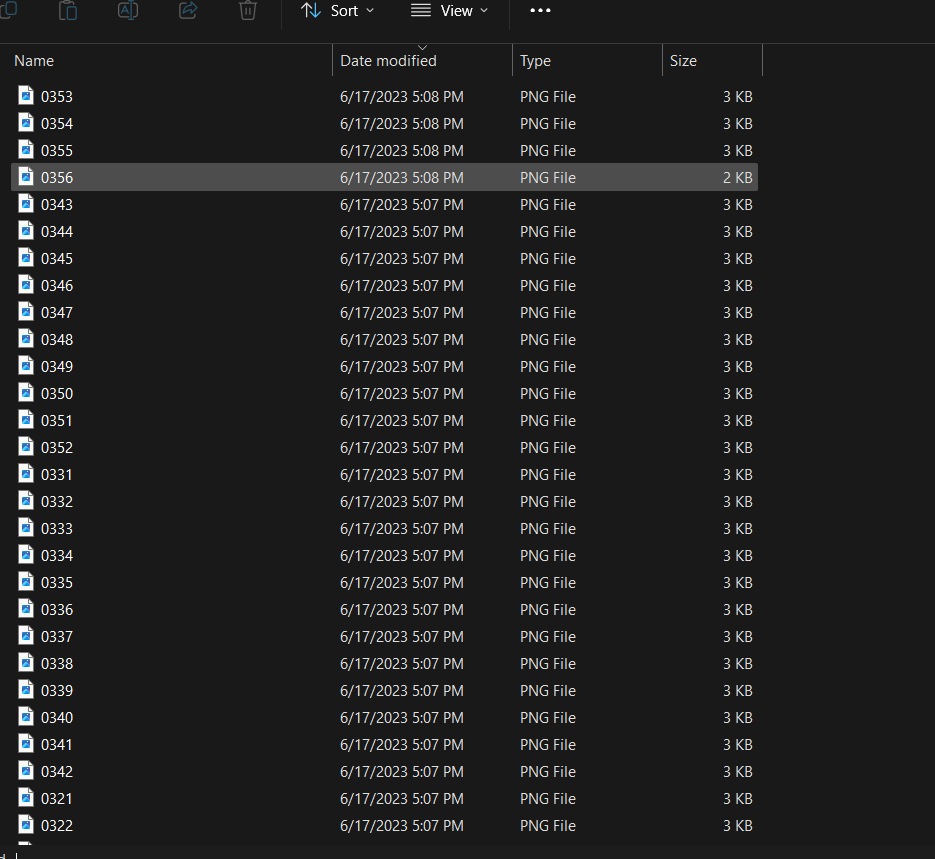

# Please don't hurt me

## DESKRIPSI
>I don't know how to create CTF challenge, pls don't hurt me.  file: [website](http://46.137.227.16/files/33dcf4d3fb349a217ecf4ac8bb723a51/images.zip?token=eyJ1c2VyX2lkIjozNywidGVhbV9pZCI6bnVsbCwiZmlsZV9pZCI6N30.ZSuQfQ.HI2uf1vidwG1XzFfuNtKswsRMK4)

## SOLUSI

Ketika file di ekstrak akan terlihat seperti ini 



terilhat bahwa ada sebuah file yang berurutan namanya dari 0000.png sampai 0356.png ketika di buka terdapat sebuah qr code , ketika qr ke 0000.png di scan munculah hasil sebuah base64 kemudian base64 itu di decode maka akan muncul seperti berikut 


terdapat sebuah teks JFIF yang mungkin saja ketika seluruh qrcode di gabungkan akan menghasilkan gambar berformat JPEG, untuk meng-scan qr code dan menggabungkan hasilnya maka dibutuhkan sebuah kode seperti berikut dengan bahasa pemrograman python

```python
import cv2

from pyzbar.pyzbar import decode

  

def baca_qr_code(nama_file):

    img = cv2.imread(nama_file)

    decoded_info = decode(img)

    return ''.join(obj.data.decode('utf-8') for obj in decoded_info)

  

def gabungkan_semua_info():

    all_info = ''

    for i in range(0, 356):

        nama_file = f'{str(i).zfill(4)}.png'

        info = baca_qr_code(nama_file)

        all_info += info

    return all_info

  

with open('output.txt', 'w') as f:

    f.write(gabungkan_semua_info())
```

kemudian kita buka outputnya yang bernama `output.txt` kemudian kita langsung decode ke sebuah image


nah flagnya ada di dalam tulisan dalam gambar

**Flag**: n1mdaCTF{d0n't_hurt_m3_af4d70ae}
