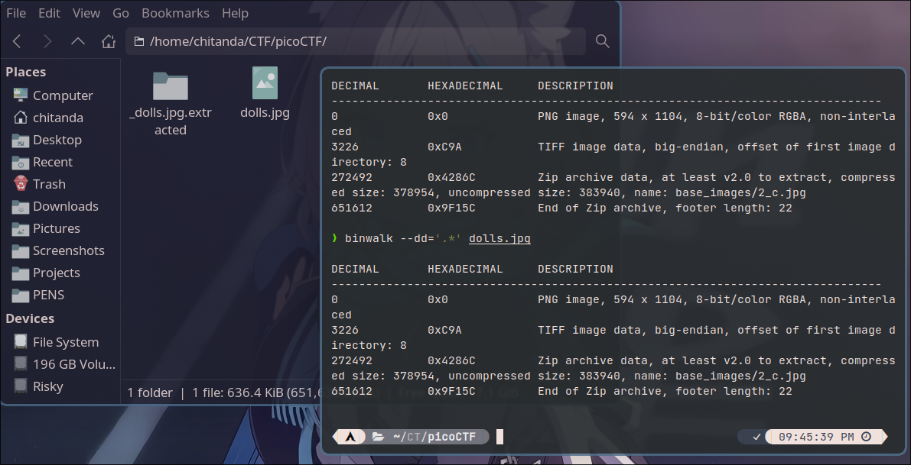
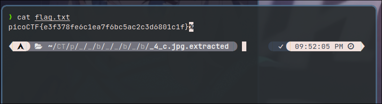

# Matryoshka doll

>Matryoshka dolls are a set of wooden dolls of decreasing size placed one inside another. What's the final one? Image: [this](https://mercury.picoctf.net/static/5ef2e9103d55972d975437f68175b9ab/dolls.jpg)

**Category: Forensics**

**Points: 30**

## Approach

Pada challenge ini, kami diberi sebuah file bernama `dolls.jpg`

Dari deskripsi, terdapat clue yaitu `Matryoshka dolls are a set of wooden dolls of decreasing size placed one inside another.`

>*Matryoshka, adalah boneka khas Rusia yang dapat diisi dengan bentuk boneka-boneka yang lebih kecil. Nama "matryoshka" diambil dari nama "Matryona", yang merupakan nama dari seorang wanita yang bertubuh gemuk.*

Untuk menemukan file tersembunyi didalam sebuah file, kita dapat menggunakan tools [binwalk](https://github.com/ReFirmLabs/binwalk) 

```shell
❯ binwalk dolls.jpg

DECIMAL       HEXADECIMAL     DESCRIPTION
--------------------------------------------------------------------------------
0             0x0             PNG image, 594 x 1104, 8-bit/color RGBA, non-interlaced
3226          0xC9A           TIFF image data, big-endian, offset of first image directory: 8
272492        0x4286C         Zip archive data, at least v2.0 to extract, compressed size: 378954, uncompressed size: 383940, name: base_images/2_c.jpg
651612        0x9F15C         End of Zip archive, footer length: 22
```

Extract menggunakan perintah `binwalk -e dolls.jpg`



Didalam folder hasil ekstrak, terdapat folder `base_images`, yang mana terdapat file bernama `2_c.jpg`.

Ulangi seperti langkah pertama, gunakan perintah `binwalk -e 2_c.jpg` 


Lakukan terus langkah tersebut hingga didapatkan sebuah file `flag.txt`



**Flag**: `picoCTF{e3f378fe6c1ea7f6bc5ac2c3d6801c1f}`
