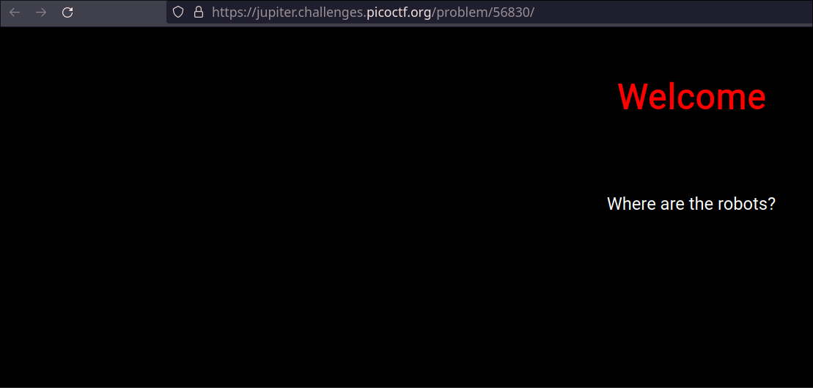
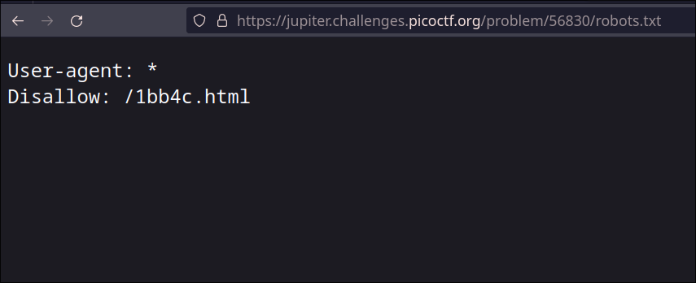
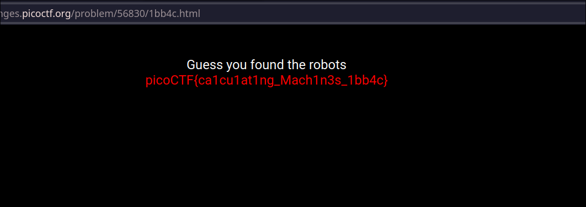

# where are the robots

>Can you find the robots? `https://jupiter.challenges.picoctf.org/problem/56830/`

**Category: Web Exploitation
Poins: 100

## Approach

Berikut ini adalah tampilan halaman ``https://jupiter.challenges.picoctf.org/problem/56830/`` ketika pertama kali dibuka

Terdapat sebuah laman selamat datang yang berisi pesan
>Where are the robots?

Clue tersebut merujuk kepada *robots.txt*

## Apa itu robots.txt?

**robots.txt** is the [filename](https://en.wikipedia.org/wiki/Filename "Filename") used for implementing the **Robots Exclusion Protocol**, a standard used by [websites](https://en.wikipedia.org/wiki/Website "Website") to indicate to visiting [web crawlers](https://en.wikipedia.org/wiki/Web_crawler "Web crawler") and other [web robots](https://en.wikipedia.org/wiki/Internet_bot "Internet bot") which portions of the website they are allowed to visit.

### Beberapa referensi mengenai robots.txt

- https://moz.com/learn/seo/robotstxt
- https://en.wikipedia.org/wiki/Robots.txt

Selanjutnya kita mencoba mengakses file robots.txt yang terdapat dalam web tersebut

> https://jupiter.challenges.picoctf.org/problem/56830/robots.txt

Terdapat rules *Disallow: /1bb4c.html* 
yanga artinya pemilik web tidak mengizinkan laman tersebut di *crawl* oleh search engine.

> https://jupiter.challenges.picoctf.org/problem/56830/1bb4c.html

Selanjutnya kita buka halaman tersebut, dan voila, kita menemukan flagnya

**Flag: `picoCTF{ca1cu1at1ng_Mach1n3s_1bb4c}`
