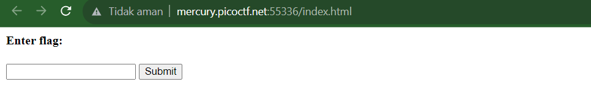
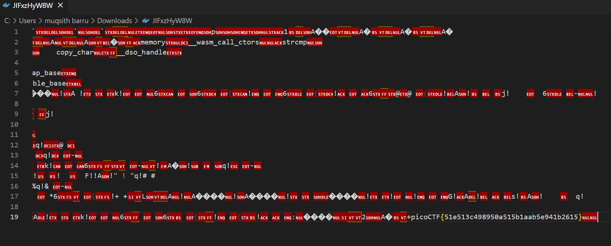

# Some Assembly Required 1

## DESKRIPSI

[http://mercury.picoctf.net:55336/index.html](http://mercury.picoctf.net:55336/index.html)

### SOLUSI

Di awal jika kita masuk ke web tersebut kita mendapat tampilan seperti berikut

setelah itu kita coba masukan sembarang ke input kemudian submit 

coba kita inspect element dan masuk ke sumber kebagian G82XCw5CX3.js nampak sebuah kode javascript yang sudah di obfucate 

coba kita geser dan cari pada line 1 sampai menemukan sebuah value `/JIFxzHyW8W` 

kemudian coba kita masukan ke url halaman web 

maka akan terdownload sebuah file yang tidak tahu ekstensinya apa, dan coba mari kita buka dengan text editor

terlihat disitu kita telah menemukan flagnya 

**FLAG** : `picoCTF{51e513c498950a515b1aab5e941b2615}  `
