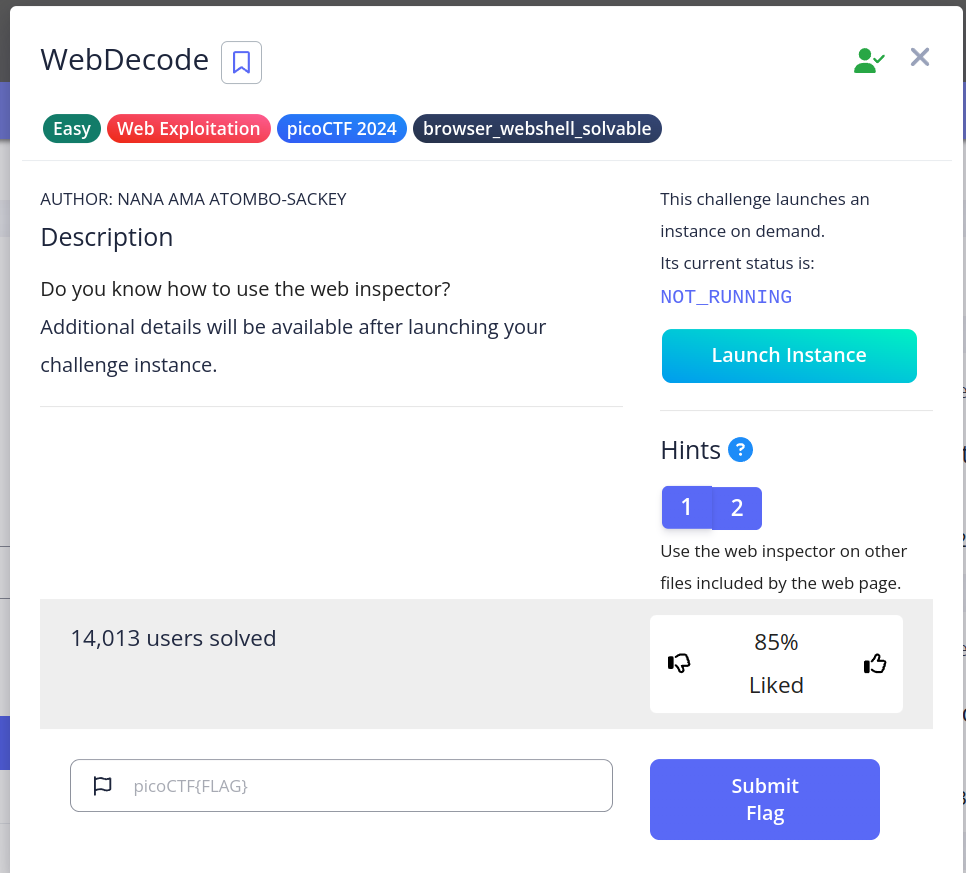
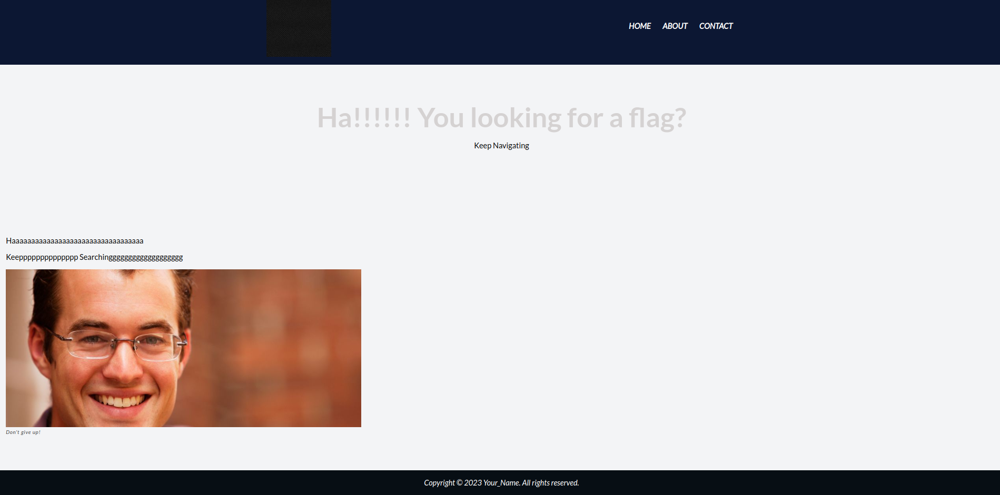
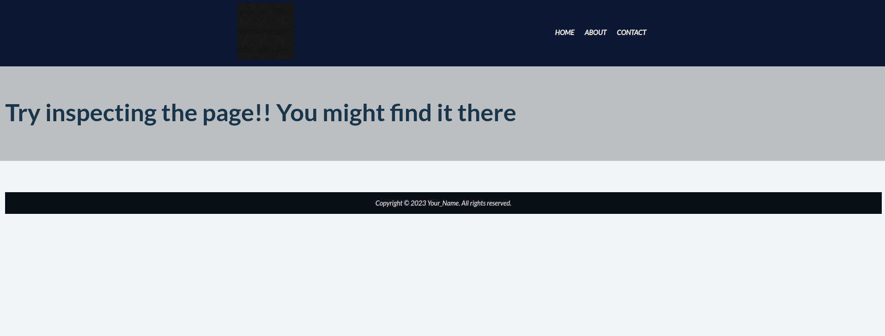
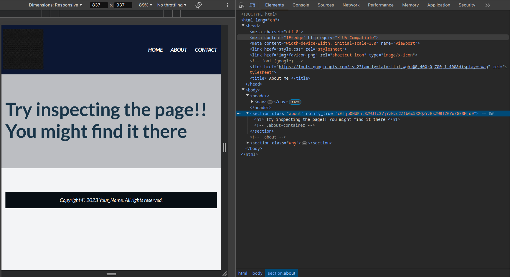
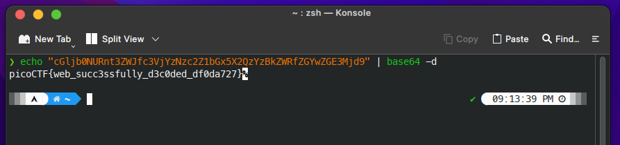
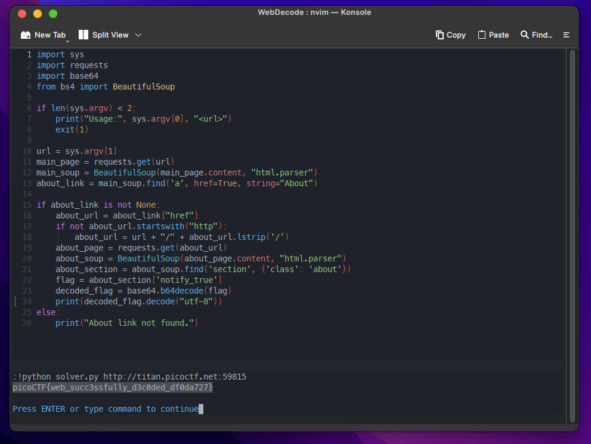

# WebDecode

>Do you know how to use the web inspector?
Additional details will be available after launching your challenge instance.

**Category: Web Exploitation** 

## Approach



Jalankan instance lalu buka halaman yang diberikan, berikut adalah tampilan halaman ketika pertama kali dibuka



Terdapat tiga buah navbar yang berada di kanan atas halaman, setelah dibuka ada hal menarik di halaman about. 



Terdapat tulisan yaitu *Try inspecting the page!! You might find it there*

Setelah melakukan inspect element, nampaknya flag tidak diberikan secara langsung. Namun disisipkan dalam bentuk base64 pada value dari attribute `notify_true` yang ada pada tag `<section>`.



Lakukan decode dan kita menemukan flagnya

```bash
 echo "cGljb0NURnt3ZWJfc3VjYzNzc2Z1bGx5X2QzYzBkZWRfZGYwZGE3Mjd9" | base64 -d
```

  

**Flag**: `picoCTF{web_succ3ssfully_d3c0ded_df0da727}`

## Solver

